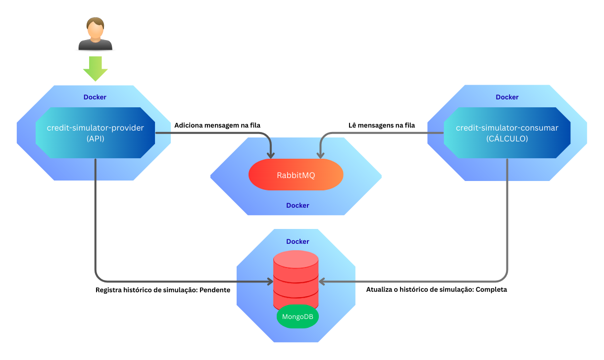

# Simulador de Crédito

Sistema distribuído de simulação de crédito construído com Spring Boot e RabbitMQ, MongoDB com processamento assíncrono..

## Arquitetura



**Provider Service** (Porta 8080): Salva as simulações com status PENDENTE no MongoDB e manda pra fila  
**Consumer Service** (Porta 8081): Pega da fila, faz os cálculos e atualiza o status da simulação  no MongoDB 
**MongoDB**: Onde fica tudo armazenado, usando drivers reativos,   
**RabbitMQ**: Menssage Broker pra comunicação assíncrona entre os serviços

## Por que essa arquitetura?

### Separação de responsabilidades
O sistema foi pensado pra escalar. **Provider** cuida só de receber requisições e guardar no banco, enquanto **Consumer** faz a parte pesada dos cálculos sem travar a API. Se um der problema, o outro continua funcionando.

### Programação reativa (Spring WebFlux)
Em vez de ficar travando threads esperando I/O, o sistema usa programação reativa. Isso significa melhor throughput, controle de backpressure automático e threads que não ficam ociosas. O resultado é um sistema que aguenta muito mais carga simultânea.

## Requisitos

### Para rodar com Docker (recomendado)
- **Docker**: 20.10+
- **Docker Compose**

### Para desenvolvimento local
- **Java**: 21+
- **Maven**: 3.8+
- **Docker**: 20.10+

### Testes
- **Node**: Opcional

## Como subir a aplicação

### Com docker
```bash
# Sobe todos os serviços 
docker-compose up -d

# Pra ver os logs em tempo real
docker-compose logs -f

# Parar tudo
docker-compose down
```

### Desenvolvimento local
```bash
# Sobe só a infraestrutura (banco e fila)
docker-compose up -d mongodb rabbitmq

# Roda os serviços na sua máquina
cd credit-simulator-provider && mvn spring-boot:run
cd credit-simulator-consumer && mvn spring-boot:run
```

## Como usar a API

Pra testar a API:

**1. Swagger UI (mais fácil)**  
Vai em http://localhost:8080/swagger-ui.html 

**2. Insomnia/Postman**  
Importa o arquivo `insomnia-collection.json` que já tem todos os endpoints configurados

## Links importantes

| Serviço | URL | Usuário/Senha |
|---------|-----|-------------|
| API Principal | http://localhost:8080 | - |
| Swagger UI | http://localhost:8080/swagger-ui.html | - |
| RabbitMQ Admin | http://localhost:15672 | admin/password |
| MongoDB | mongodb://localhost:27017 | admin/password |

## Testes

Para criar dataSets de requisição utilize o script: GenerateRequestsScriptjs

```bash
# Gerar payloads de request com carga maior
node GenerateRequestsScript.js
```

```bash

# Testes unitários (cobertura de 90%+)
cd credit-simulator-provider && mvn test
cd credit-simulator-consumer && mvn test

# Teste de performance (1000 simulações em menos de 5s)
mvn test -Dtest=LoadTest
```

## Acessar o MongoDB

```bash
# Conecta no MongoDB
docker exec -it credit-simulator-mongodb mongosh -u admin -p password --authenticationDatabase admin

# Seleciona o banco
use credit_simulator

# Lista as simulações
db.creditSimulation.find().pretty()

# Conta total de documentos
db.creditSimulation.countDocuments()
```

## Fluxo da arquitetura

1. **Cliente**  Faz uma requisição POST pro Provider
2. **Provider** Valida dados e salva simulação com status PENDENTE no MongoDB
3. **Provider** Publica mensagem no RabbitMQ e retorna resposta pro cliente
4. **Consumer** Pega a mensagem da fila assincronamente
5. **Consumer** Faz os calculos (Strategy para taxa fixa ou variável)
6. **Consumer** Atualiza os valores finais para o status CONCLUÍDA
7. **Cliente**  Consulta resultado fazendo GET na API com conversão de moeda opcional

Observação: Por questóes de simplificação e performance da arquitetura, não há atualização de menssagens no Rabbit (fire-and-forget).

## Performance e escalabilidade

- **5000+ simulações por segundo** em processamento batch
- **Conversão de moedas** (BRL/USD/EUR) em tempo real
- **Retry automático** quando dá erro
- **Reactive Streams**: Spring WebFlux com I/O não-bloqueante
- **Batch Processing**: Chunks de 1000 com máximo 2 paralelos
- **Backpressure**: Controle automático quando tá sobrecarregado

## Trade-offs e decisões de design

### Benefícios alcançadoso
- **Tolerância a falhas**: Se um serviço cair, o outro continua funcionando
- **Performance alta**: Programação reativa aguenta muito mais carga
- **Manutenibilidade**: Clean Archictecture facilita evolução
- **Complexidade operacional**: Mais serviços = mais complexidade de deploy
- **Consistência eventual**: Tem delay entre requisição e resultado final
- **Overhead de rede**: Comunicação entre serviços via RabbitMQ
- **Fluxo Rabbit**: Adota "fire-and-forget" para simplificação da arquitetura.

## Tecnologias e design patterns

### Core
- **Java 21** + Spring Boot
- **Spring WebFlux** (programação reativa)
- **MongoDB** (drivers reativos)
- **RabbitMQ** (message broker)

### Patterns
- **Strategy Pattern** (escolha de taxas)
- **Factory Pattern** (conversão de moedas)
- **Clean Architecture** (separação de camadas)
- **Immutable Objects** (thread safety)